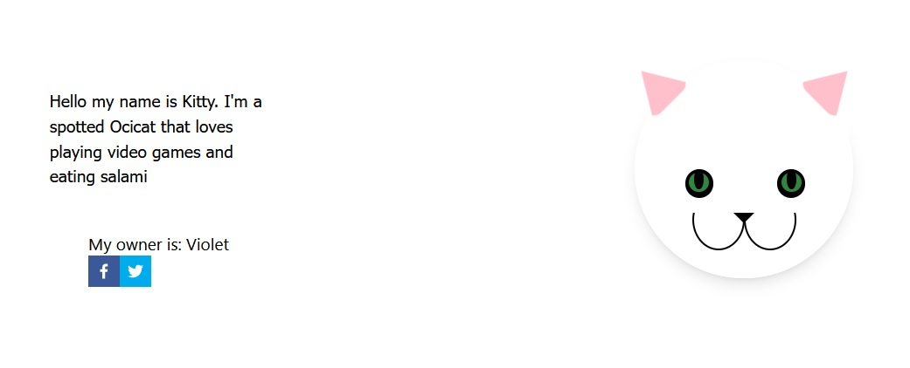
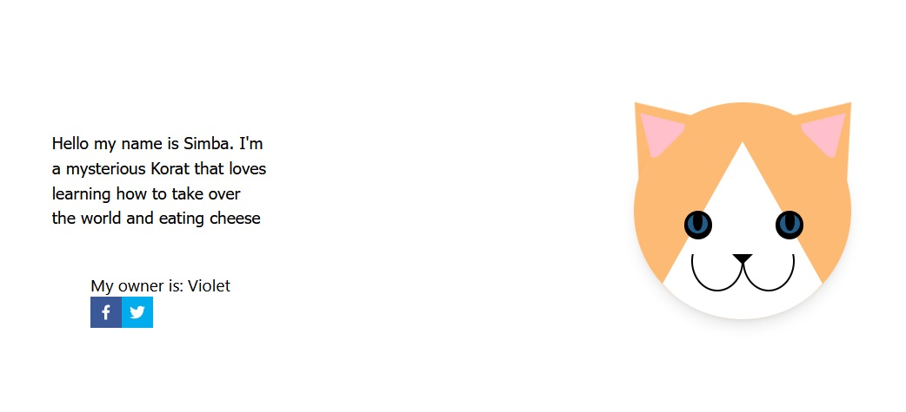
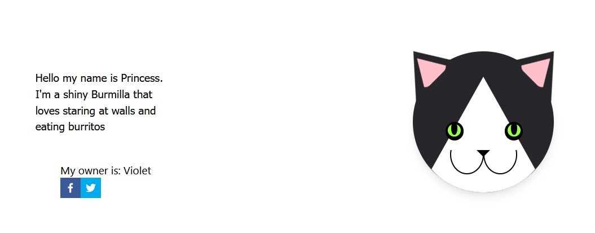

# This Cat Does Not Exist

This was created for a 3 day "hackaton" for Full Stack Academy Cohort 2109. The goal was to create a nicely styled cat that would be generated from seed data. The seed data is gathered by using the seed value as a paramater and hashing through an array.

This means that the same cat will be rendered everytime that specific seed is referenced.

## Technologies used

- React-JS
- Next.JS
- Tailwind CSS
- Firebase (FireStore)
- Babel
- YAML

## Features to be added

- Account feature (using Firestore) to see all the cats you've adopted.
- Travel to this ${specificNumber} seed, to view a specific cat.
- Adding more to the cats CSS styling (like a body).
- Generating a lot more random text and descriptions using Improv node module.

## Some of my favorite cats

